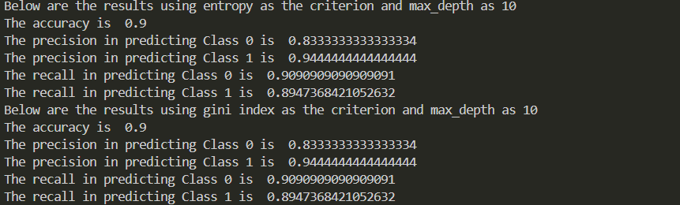
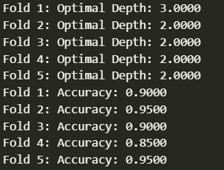

# Decision Tree Classification with Nested Cross-Validation

## Overview

We tested the implementation of a Decision Tree classifier to perform binary classification on a synthetic dataset. The model is evaluated using nested cross-validation to determine the optimal tree depth, and the performance metrics (accuracy, precision, and recall) are calculated. Additionally, the classifier's performance using both the entropy and Gini index criteria is compared.

## Code Explanation

### 1. Importing Necessary Libraries

```python
import pandas as pd
import numpy as np
import matplotlib.pyplot as plt
from tree.base import DecisionTree
from metrics import *
from sklearn.datasets import make_classification
from sklearn.model_selection import train_test_split
```

### 2. Defining Cross Validation Function

```python
def crossvalidation(X, y):
    k = 5
    fold_size = len(X) // k

    accuracies = []

    for i in range(k):
        test_start = i * fold_size
        test_end = (i + 1) * fold_size
        X_test = X[test_start:test_end].reset_index(drop=True)
        y_test = y[test_start:test_end].reset_index(drop=True)

        X_train = pd.concat([X[:test_start], X[test_end:]]).reset_index(drop=True)
        y_train = pd.concat([y[:test_start], y[test_end:]]).reset_index(drop=True)

        accuracies_inner_fold = []

        for j in range(k):
            inner_fold_size = len(X_train) // k
            validation_start = j * inner_fold_size
            validation_end = (j + 1) * inner_fold_size

            X_val = X_train[validation_start:validation_end].reset_index(drop=True)
            y_val = y_train[validation_start:validation_end].reset_index(drop=True)

            X_inner_train = pd.concat([X_train[:validation_start], X_train[validation_end:]]).reset_index(drop=True)
            y_inner_train = pd.concat([y_train[:validation_start], y_train[validation_end:]]).reset_index(drop=True)

            accuracy_depths = []

            for depth in range(2, 9):
                classifier = DecisionTree(max_depth=depth, criterion="gini_index", Type="Classification", discrete_features=False)
                classifier.fit(X_inner_train, y_inner_train)
                predictions_val = classifier.predict(X_val)

                accuracy_depths.append(accuracy(y_val, predictions_val))

            accuracies_inner_fold.append(accuracy_depths)

        mean_accuracies = np.mean(np.array(accuracies_inner_fold), axis=0)
        optimal_depth = np.argmax(mean_accuracies) + 2

        print("Fold {}: Optimal Depth: {:.4f}".format(i+1, optimal_depth))

        classifier_final = DecisionTree(max_depth=optimal_depth, criterion="gini_index", Type="Classification", discrete_features=False)
        classifier_final.fit(X_train, y_train)
        predictions_test = classifier_final.predict(X_test)

        fold_accuracy = accuracy(y_test, predictions_test)
        accuracies.append(fold_accuracy)

    for i in range(k):
        print("Fold {}: Accuracy: {:.4f}".format(i+1, accuracies[i]))
```

#### Explanantion of the function

<ul>
<li>The number of Folds is defined to be 5 and the fold size is figured out by dividing the length of the dataframe by the number of folds </li>

<li> We then iterate through each fold,(each with different testing and training datasets)</li>

<li>We then perform nested cross validation with 5 validation folds</li>

<li>Within each validation fold, we train decision trees from depth 2 to 8, and store the accuracies as an array in the `accuracies_cross_validation` variable.</li>

<li>After iterating through all the validataion folds, we find the optimal depth for a decision tree for that fold by taking the mean across the accuracies of the predicted values given on each of the validataion folds</li>

<li>After figuring out the optimal depth, a new decision tree of the optimal depth is trained on both the train and validatation set. This decision tree is then tested for accuracy on the test set, and this accuracy is reported</li>
</ul>

### Creating Dataset

The code the create the dataset:

```python
X, y = make_classification(
    n_features=2, n_redundant=0, n_informative=2, random_state=1, n_clusters_per_class=2, class_sep=0.5)
```

### Testing implemeneted Decision Tree

The created dataset is split into a 70 - 30 test train split. The decision tree is trained on the train data with depth 10 (arbitrary depth). For the criterion hyper parameters, both gini and entropy are taken to train different decision trees, ( Which in the end gave the same accuracy on the test dataset)

The metrics such as accuracy precision and recall are outputted

<center>

</center>
Then Cross validataion was performed and the accuracies for each fold as well as the optimal depth was outputted
<center>

</center>

We can see that the optimal depth is calculated to be 2 for most folds.
