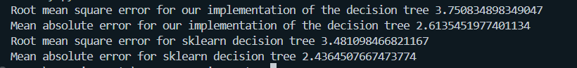

## Testing Decision Tree on the automotive efficiency problem

The code used to obtain all our results can be found in `auto-efficiency.py`

The first preprocessing step that we took up was to remove all the rows with junk data, this was particularly common in the `horsepower` column where cars had '?' instead of the horsepower value. Also all these values were strings which werent particularly useful so they were all converted to floating point values. Also the `car name` column was dropped to utilise the Real Input Real Output version of the decison tree on the given data.

```python

data = data[data["horsepower"] != "?"]
data["horsepower"] = data["horsepower"].astype('float')
data.drop(columns=["car name"], inplace=True)

```

The data was then split into training and testing data in a 70 : 30 split and trained on our implementation of the decision tree and sklearn. The results we obtained are as follows.



We can see that the difference in Mean Absolute error and Root Mean square error from the sklearn implementation and our implementation is pretty small, indicating that our implementation performs well in such regression tasks.
