### Decision Tree Time Complexity Testing

We have performed several experiments to verify the time-complexity of learning the decision tree and prediciting test data from the learned decision tree. We have used a dataset of **N** rows and **M** features(in case of discrete features, we have used only binary features) for training the decision tree. For prediction using the decison tree, we have used the same **N** samples.

Two types of experiments have been performed, one by varying **N** in the range [10,30,50,70,100] while keeping **M** constant at a value 10. Another by varying in **M** the range [5,10,15,20,25] while keeping **N** constant at 20. When N is varied, depth is kept constant at d = 10, but when m is varied, we have set infinite depth for the tree. Each experiment for a particular M and N is run for 100 times and then the average is taken.

We will observe and discuss all these results below. The code used in obtaining all these graphs can be found in `experiments.py`

## Discrete input Discrete output

  

  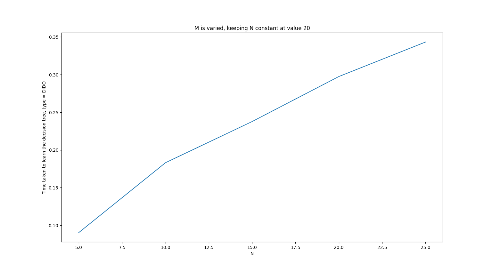
  
  

We can see that when keeping one of **N** and **M** constant while varying the other gives a linear trend in the time taken to learn the decision tree. For M discerete binary features, each node has only one split to check per feature (But the implementation still takes O(n) for this since impurity measure has to calculated) and there are M such features to process to determine the optimal split. Splitting process itself is $O(N)$ So we could say that the theoretical time complexity is $O(N \times M \times 2^D)$ for a tree of depth D.

The practical observations also match with the theoritical time complexity.

  

  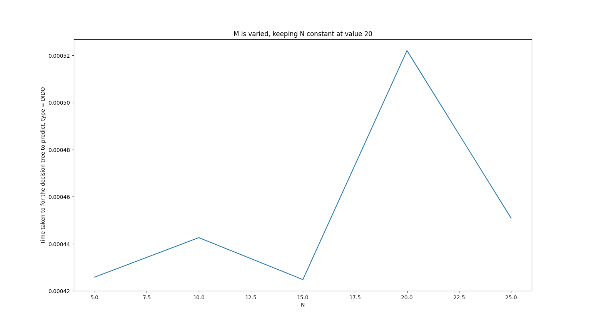
  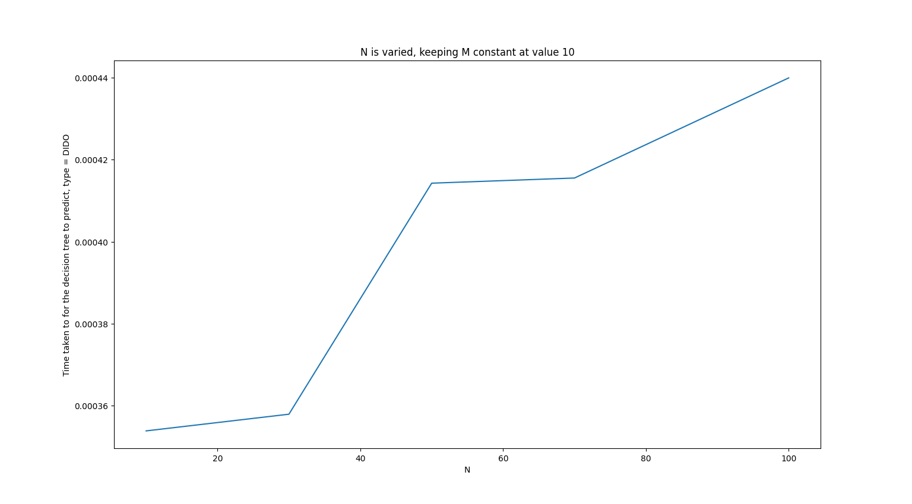
  

We can see no clear trend in time taken to predict when varying **M** and we coulld very well say the times taken are almost the same. Whereas a clear linear pattern is present in the case where we vary **N**. This suggests the time complexity is independent of M and depends only on **N**.

Theoretically speaking, the method of prediction involves traversing the decision tree and thus depends on the depth of the decison tree and the number of predictions to make, so the time complexity to predict **N** samples is $O(N \times D)$ where D is the depth of the tree.

## Discrete input Real output

  

  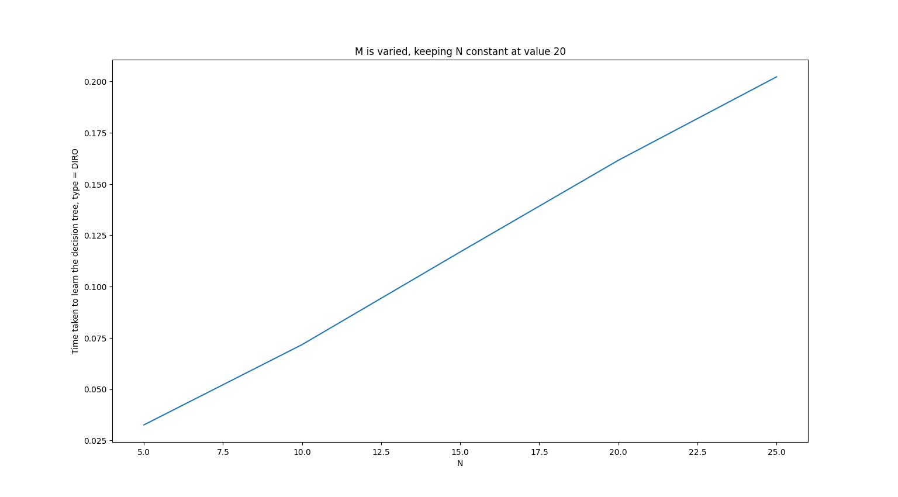
  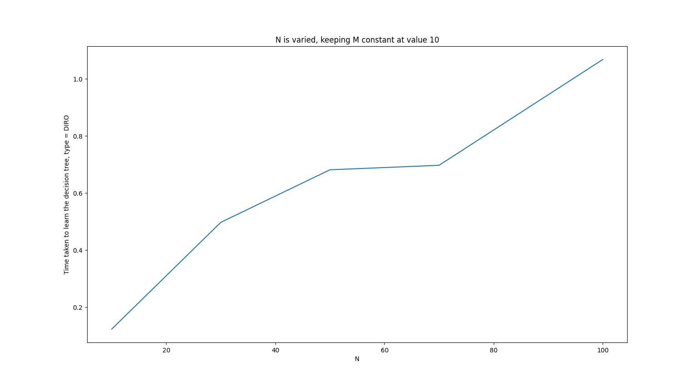
  

We can see that when keeping one of **N** and **M** constant while varying the other gives a linear trend in the time taken to learn the decision tree. For M discerete binary features, each node has only one split to check per feature (But the implementation still takes O(n) for this since impurity measure has to calculated) and there are M such features to process to determine the optimal split. Splitting process itself is $O(N)$ So we could say that the theoretical time complexity is $O(N \times M \times 2^D)$ for a tree of depth D.

The practical observations also match with the theoritical time complexity.

  

  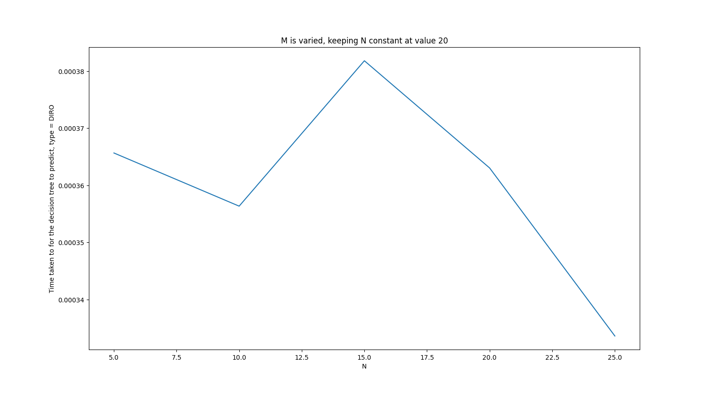
  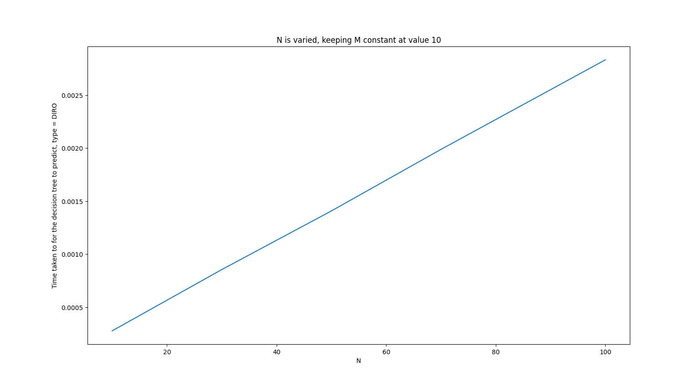
  

We can see no clear trend in time taken to predict when varying **M** and we coulld very well say the times taken are almost the same. Whereas a clear linear pattern is present in the case where we vary **N**. This suggests the time complexity is independent of M and depends only on **N**.

Theoretically speaking, the method of prediction involves traversing the decision tree and thus depends on the depth of the decison tree and the number of predictions to make, so the time complexity to predict **N** samples is $O(N \times D)$ where D is the depth of the tree.

## Real input discrete output

  

  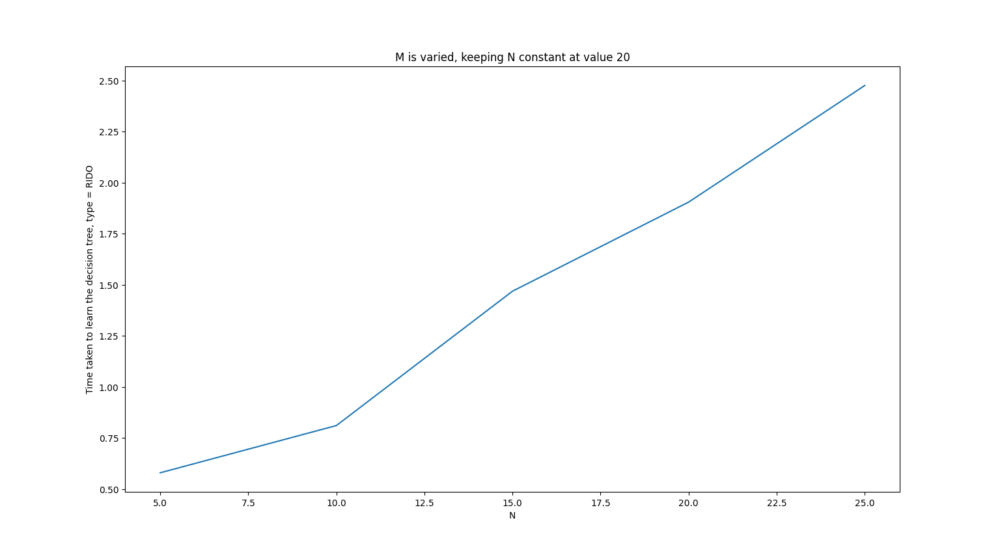
  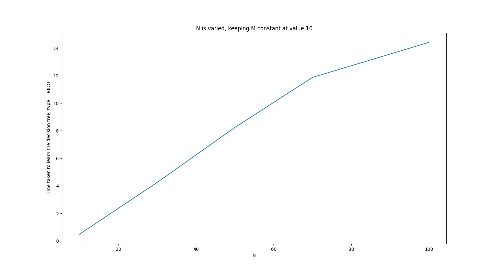
  

We can see that when keeping one of N and M constant while varying the other gives a linear trend in the time taken to learn the decision tree. For M real features, each node has (N-1) splits to check per feature worst case (when all values are non unique for that feature) and implementation first sorts the values for that feature, and there are M such features to process to determine the optimal split. Splitting process itself is $O(N)$ So we could say that the theoretical time complexity is $O(N log(N)\times M \times 2^D)$ for a tree of depth D.
$nlog(n)$ curves look similar to n curves and thus our practical observations align with the theoretical time complexity too.

  

  
  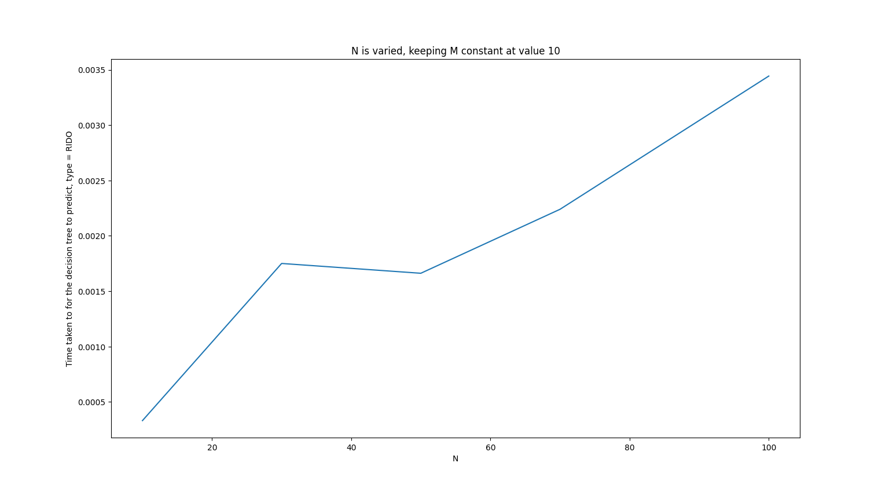
  

We can see no clear trend in time taken to predict when varying **M** and we coulld very well say the times taken are almost the same. Whereas a clear linear pattern is present in the case where we vary **N**. This suggests the time complexity is independent of M and depends only on **N**.

Theoretically speaking, the method of prediction involves traversing the decision tree and thus depends on the depth of the decison tree and the number of predictions to make, so the time complexity to predict **N** samples is $O(N \times D)$ where D is the depth of the tree.

## Real input real output

  

  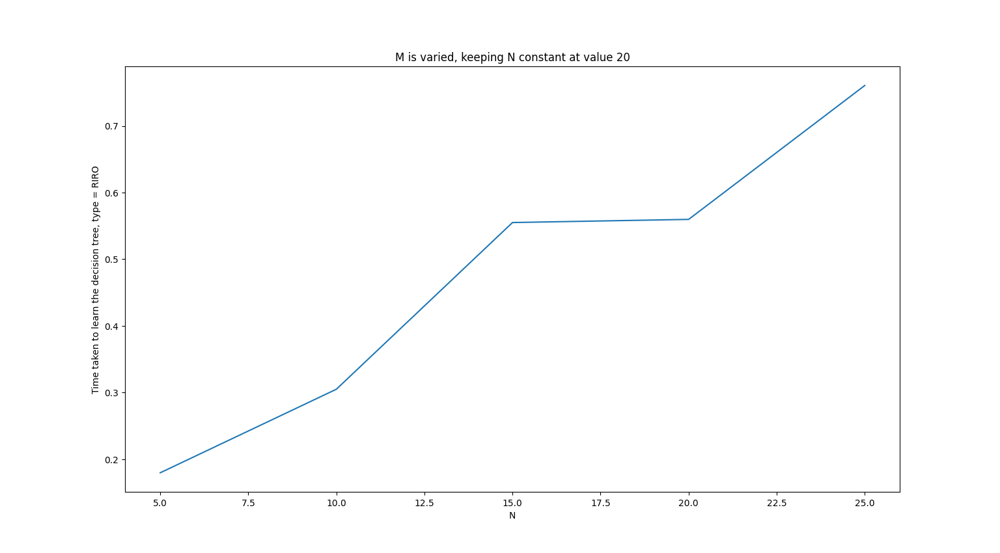
  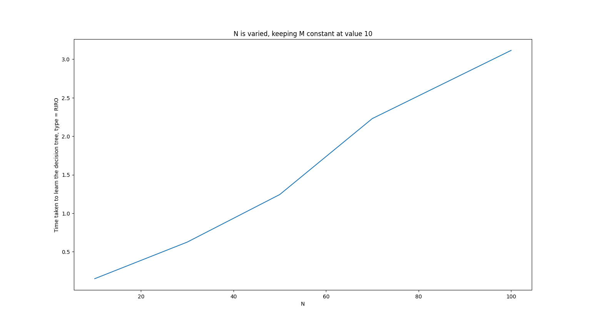
  

We can see that when keeping one of N and M constant while varying the other gives a linear trend in the time taken to learn the decision tree. For M real features, each node has (N-1) splits to check per feature worst case (when all values are non unique for that feature) and implementation first sorts the values for that feature, and there are M such features to process to determine the optimal split. Splitting process itself is $O(N)$ So we could say that the theoretical time complexity is $O(N log(N)\times M \times 2^D)$ for a tree of depth D.
$nlog(n)$ curves look similar to n curves and thus our practical observations align with the theoretical time complexity too.

  

  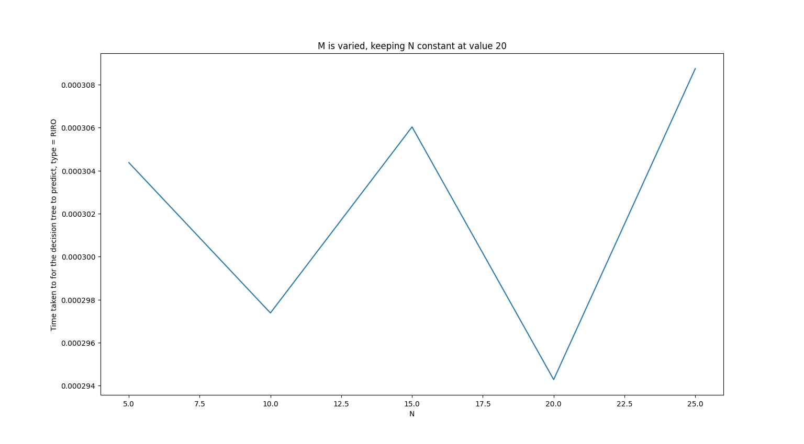
  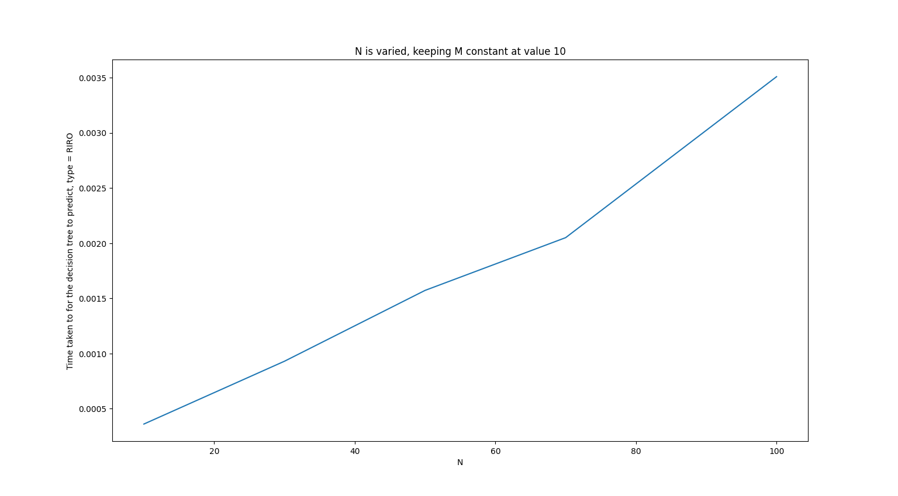
  

We can see no clear trend in time taken to predict when varying **M** and we coulld very well say the times taken are almost the same. Whereas a clear linear pattern is present in the case where we vary **N**. This suggests the time complexity is independent of M and depends only on **N**.

Theoretically speaking, the method of prediction involves traversing the decision tree and thus depends on the depth of the decison tree and the number of predictions to make, so the time complexity to predict **N** samples is $O(N \times D)$ where D is the depth of the tree.
